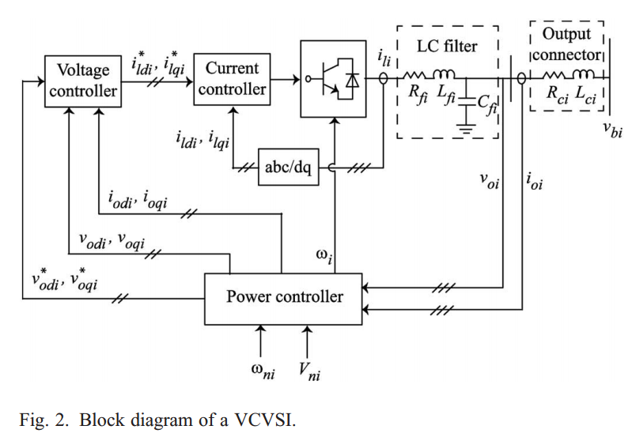
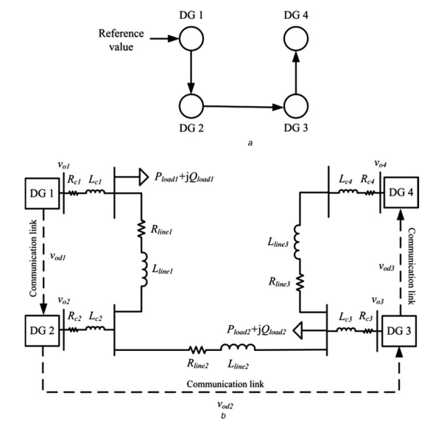
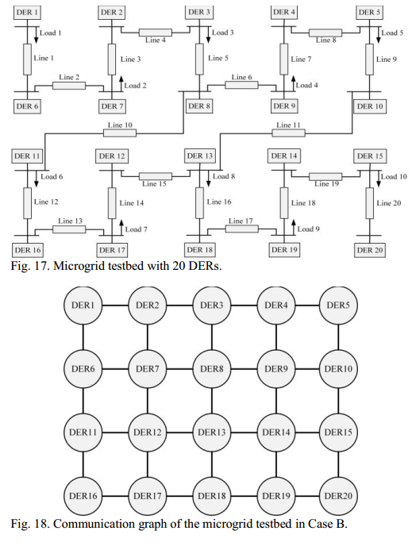
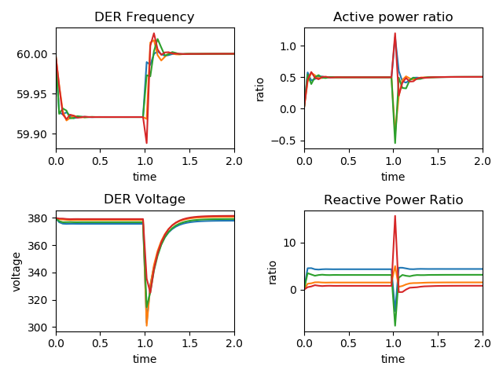

Large-scale Islanded Microgrids based on PID Control Methods
===============
- Built by Dong Chen from Michigan State University
- Started on Feb.01, 2020

Overview
-------
We plan to develop a power grid simulation platform with large number of DERs. Problems we are targeting at are voltage and frequency stabilization and power sharing among DERs. There is another version of python-implementation of IEEE-34 bus system at [Link.](https://github.com/Derekabc/Microgrid_34_bus)


Code Structure
--------
- [main.py](main.py): the main function used to run the whole project. In this file, you can choose the DER and system configurations.
- [DER_fn.py](DER_fn.py): This is the graph generation function and will be called by the main.py function.
- [configs/parameters_4.py](configs/parameters_4.py): This is the configuration file for the 4 DER system.
- [configs/parameters_20.py](configs/parameters_20.py): This is the configuration file for the 20 DER system.

In the implementation, we should build a similar configuration file and list the system configurations. We can claim our system design in the main function and keep the graph generation function unchanged. Now our function provides,

- [x] Normal volatge and frequency control.
- [x] Critical bus volatge and frequency control.
- [ ] Input parameters of microgrid system by excel or cvs file.

Last two functions will be added in the near future.

System Design
---------
In this section, we will briefly illutrate the system design. Primary and second controller.

<p align="center">
     
     <br>Fig.1 Architecture of the inverter-based VCVSI.
</p>


Graph Genration Function
---------
To make our life easy, we try to build a graph generation function, thus when we want to test a new microgrid system, we can just list the parameters and let the code to generate the architecture automatically.

To be added...


Experiments & Analysis
---------
- The first experiment is the frequency and voltage control for 4-DER and 20-DER microgrid systems. 

We adapt the DER system proposed in reference [1]. The architecture is given by Fig.1. In this system, only the first DER unit can access the reference value of frequency and voltage, while all the other DERs need to communicate with its neighbors to track the reference values.

<p align="center">
     
     <br>Fig.1 Architecture and communication graph of 4-DER microgrid test system.
</p>

<p align="center">
     
     <br>Fig.2 Frequency and voltage of 20 DER system
</p>

To build a large-scale microgrid system, we try our generation function on a 20-DER system, which is presented by reference [3]. The architecture is given by Fig.3.

<p align="center">
     
     <br>Fig.3 Architecture and communication graph of 20-DER microgrid test system.
</p>

<p align="center">
     
     <br>Fig.4 Frequency and voltage of 20 DER system
</p>


- The second experiment is to achieve the critical bus voltage control.

<p align="center">
     
     <br>Fig.5 Critic bus frequency and voltage of 4 DER system
</p>

<p align="center">
     
     <br>Fig.6 Critic bus frequency and voltage of 20 DER system
</p>


Cite
---------
```
@article{chen2021powernet,
  title={Powernet: Multi-agent deep reinforcement learning for scalable powergrid control},
  author={Chen, Dong and Chen, Kaian and Li, Zhaojian and Chu, Tianshu and Yao, Rui and Qiu, Feng and Lin, Kaixiang},
  journal={IEEE Transactions on Power Systems},
  volume={37},
  number={2},
  pages={1007--1017},
  year={2021},
  publisher={IEEE}
}
```

Reference
---------
1. Bidram, Ali, Ali Davoudi, and Frank L. Lewis. "A multiobjective distributed control framework for islanded AC microgrids." IEEE Transactions on industrial informatics 10.3 (2014): 1785-1798.

2. Bidram, Ali, et al. "Distributed cooperative secondary control of microgrids using feedback linearization." IEEE Transactions on Power Systems 28.3 (2013): 3462-3470.

3. Mustafa, Aquib, et al. "Detection and Mitigation of Data Manipulation Attacks in AC Microgrids." IEEE Transactions on Smart Grid (2019).
